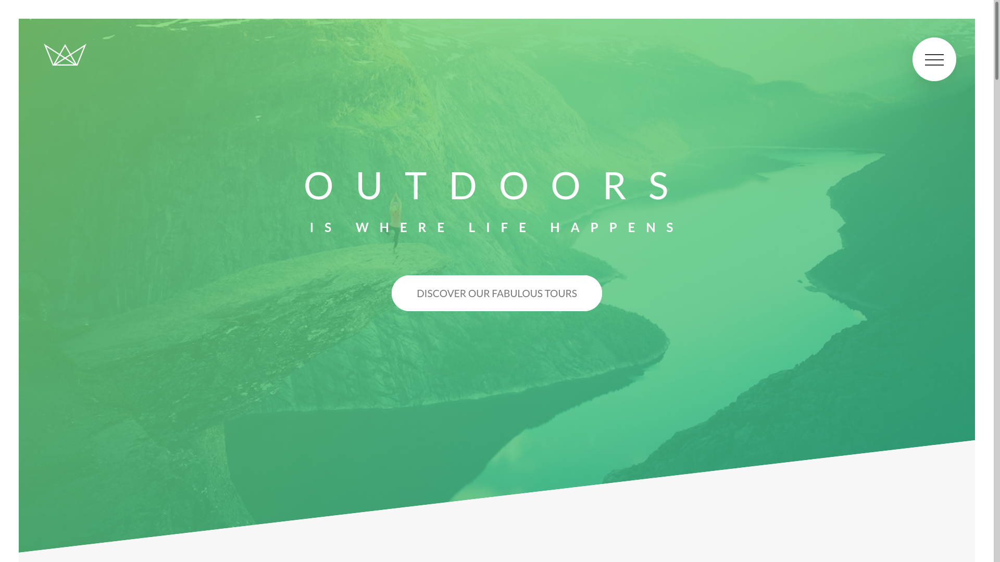

# Fabulous-tours

> This project built for a travel agency specialized in outdoors trips and adventures the project built entirely  with HTML, CSS, and SASS.

## Built With

- HTML
- CSS
- SASS

## Live Demo

[View Live](https://fabuloustours.netlify.app/)

👤 **Shaher Shamroukh**
 
[<code></code>](https://github.com/Shaher-11)
[<code></code>](https://twitter.com/ShaherShamroukh/)
[<code></code>](https://www.linkedin.com/in/shaher-shamroukh/)
 
 

## Show your support

Give a ⭐️ if you like this project!

## Acknowledgments

- Jonas Schmedtmann
- CSS tricks

## 📝 License

This project is [MIT](lic.url) licensed.
